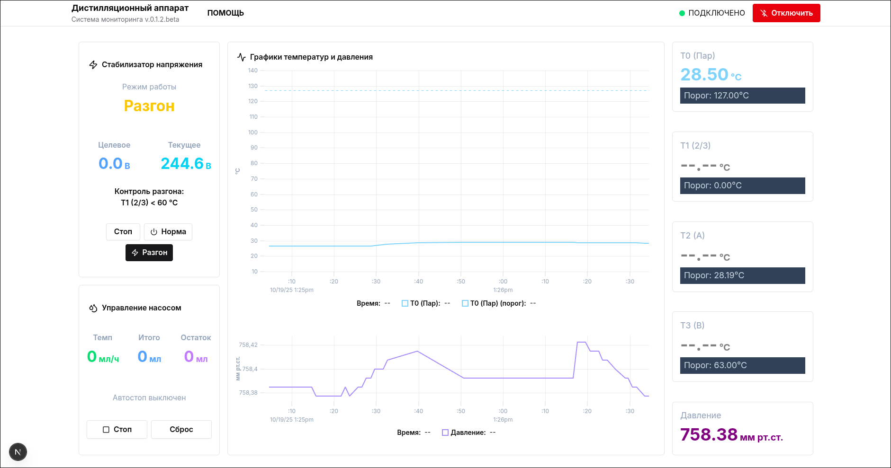
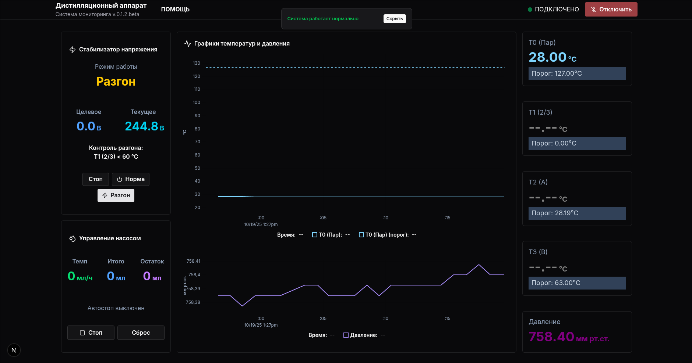
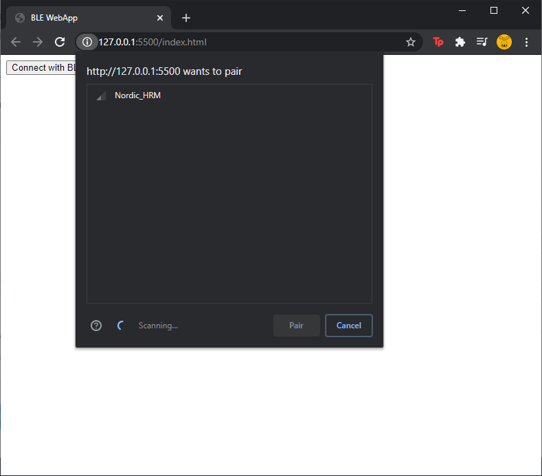

# Bluetooth Монитор

Неофициальный веб-клиент для программно-аппаратного комплекса контроля и управления ректификационной колонной, за авторством [kvic68](https://github.com/kvic68/PAC-RK).

## 🎯 Возможности

- **Мониторинг в реальном времени**: Отслеживание до 4 температурных датчиков, давления и состояния системы
- **Bluetooth подключение**: Подключение к различным типам устройств(для разных com портов) с автоматическим обнаружением UUID
- **Управление насосом**: Управление скоростью насоса и дозировкой с поддержкой калибровки значения шага (запись в EEPROM)
- **Стабилизация напряжения**: Регулировка напряжения смена режима работы
- **Контроль нагрева**: В режиме разгона, контроль температуры на выбранном датчике
- **Адаптивный дизайн**: Работает на настольных и мобильных устройствах

## Скриншоты

### Главная панель





### Bluetooth подключение



## Технологический стек

- **Фреймворк**: Next.js 15 (App Router)
- **Язык**: TypeScript
- **Стилизация**: Tailwind CSS v4
- **UI компоненты**: shadcn/ui
- **Управление состоянием**: React Context API
- **Получение данных**: SWR
- **Bluetooth**: Web Bluetooth API

## Требования

- Node.js 18+ и npm/yarn/pnpm
- Браузер с поддержкой Web Bluetooth (Chrome, Edge, Opera)
- HTTPS соединение (требуется для Web Bluetooth API)
- Совместимое Bluetooth serial устройство

### Совместимость браузеров

Web Bluetooth API поддерживается в:

- ✅ Chrome/Chromium 56+
- ✅ Edge 79+
- ✅ Opera 43+
- ❌ Firefox (не поддерживается)
- ❌ Safari (не поддерживается)

## 🛠️ Установка

1. **Клонируйте репозиторий**

   ```bash
   git clone https://github.com/quotam/wba-packrc.git
   cd wba-packrc
   ```

2. **Установите зависимости**

   ```bash
   npm install
   #или
   yarn install
   #или
   pnpm install
   ```

3. **Запустите сервер разработки**

   ```bash
   npm run dev
   #или
   yarn dev
   #или
   pnpm dev
   ```

4. **Откройте в браузере**
   Перейдите по адресу `https://localhost:3000` (HTTPS требуется для Web Bluetooth)

> **Примечание**: Web Bluetooth api, будет работать если у вас https соединение или если приложение запущенно на localhost

## 📱 Использование

### Подключение к устройству

1. Нажмите кнопку **"Подключить устройство"** в заголовке
2. Выберите ваше Bluetooth устройство из диалога браузера
3. Приложение автоматически обнаружит правильные service UUID и характеристики
4. После подключения начнется потоковая передача данных в реальном времени

### Поддерживаемые команды

Приложение поддерживает следующие команды устройства:

- **Z0**: Инициализация устройства и запрос калибровочных данных
- **Z1{hex8}**: Калибровка насоса с новыми шагами для 100мл
- **U{0|1|2}**: Установка режима стабилизатора (Нормальный/Принудительный/Стоп)
- **P{hex4}**: Установка скорости насоса (0-3000)
- **V{hex4}**: Установка значения дозы/остатка (0-5000)
- **R0**: Запуск насоса
- **T{hex4}**: Установка целевого напряжения (0-2500, масштабируется на 10)
- **M{index}{hex4}{reaction}**: Установка границы датчика и реакции
- **Y{enabled}{sensor-index}{hex4}**: контроль разгона управления

## 🔧 Конфигурация

### Профили устройств

Приложение автоматически определяет распространенные UUID сервисов Bluetooth serial:

- Модули HM-10/HM-11: `0000ffe0-0000-1000-8000-00805f9b34fb`
- Nordic UART Service: `6e400001-b5a3-f393-e0a9-e50e24dcca9e`
- Microchip Transparent UART: `49535343-fe7d-4ae5-8fa9-9fafd205e455`

Если ваше устройство использует другие UUID, приложение автоматически обнаружит и использует их.

### Валидация датчиков

Температурные датчики валидируются по следующим правилам:

- Допустимый диапазон: от -55°C до 127°C
- Обнаружение ошибок при сбоях датчика
- Автоматическая обработка состояния ошибки

## 🐛 Устранение неполадок

### Устройство не появляется в списке

- Убедитесь, что ваше устройство включено и находится в режиме сопряжения
- Проверьте, что Bluetooth включен на вашем компьютере
- Попробуйте обновить страницу и переподключиться
- Убедитесь, что ваш браузер поддерживает Web Bluetooth API

### Обрывы соединения

- Проверьте силу сигнала Bluetooth
- Убедитесь, что устройство находится в зоне действия (обычно 10 метров)
- Проверьте уровень заряда батареи устройства
- Проверьте консоль браузера на наличие сообщений об ошибках

### Ошибка "Требуется HTTPS"

Web Bluetooth API работает только через HTTPS. Для локальной разработки:

- Используйте `localhost` (автоматически считается безопасным)
- Или настройте локальный HTTPS сертификат
- Или используйте туннельный сервис, такой как ngrok

### Данные не обновляются

- Убедитесь, что устройство отправляет данные (проверьте логи консоли)
- Убедитесь, что используются правильные характеристики
- Проверьте, что прошивка устройства совместима
- Попробуйте отключиться и переподключиться

## 🏗️ Структура проекта

```

├── app/ # Next.js app directory (роутинг и страницы)
│ ├── (main)/ # Основная группа маршрутов
│ ├── (info)/ # Информационные страницы (help, privacy, terms)
│ ├── \_providers/ # Провайдеры контекста приложения
│ ├── \_widgets/ # Виджеты уровня приложения
│ ├── layout.tsx # Корневой layout
│ ├── globals.css # Глобальные стили
│ └── sw.ts # Service Worker
│
├── entities/ # основная логика приложения (bluetooth-device и др.)
│
├── features/ # Функциональные модули
│ ├── chart/ # Графики и визуализация данных
│ ├── control/ # Элементы управления устройством
│ ├── error/ # Обработка ошибок 5XX
│ ├── sensor/ # Работа с датчиками
│ └── status/ # Отображение статуса toast
│
├── kernel/ # Ядро приложения
│ ├── domain/ # Доменная логика и типы
│ ├── hooks/ # Общие хуки
│ └── lib/ # Утилиты ядра
│
├── shared/ # Общие ресурсы
  ├── config/ # Конфигурация
  ├── lib/ # Утилиты
  └── ui/ # UI компоненты

```

> **Примечание**: Структура проекта может изменяться по мере развития приложения. Актуальную структуру всегда можно посмотреть в файловой системе проекта.

## 🤝 Вклад в проект

Вклады приветствуются!

1. Сделайте Fork репозитория
2. Создайте ветку для вашей функции (`git checkout -b feature/AmazingFeature`)
3. Закоммитьте ваши изменения (`git commit -m 'Add some AmazingFeature'`)
4. Отправьте в ветку (`git push origin feature/AmazingFeature`)
5. Откройте Pull Request

## 🙏 Благодарности

Автору комплекса и оригинального приложения [kvic68](https://github.com/kvic68/PAC-RK)

## 📞 Поддержка

Если вы столкнулись с какими-либо проблемами или у вас есть вопросы, пожалуйста, откройте issue на GitHub.

---

**Примечание**: Это приложение требует совместимое Bluetooth serial устройство. Убедитесь, что ваше оборудование поддерживает протокол связи, описанный в документации.
